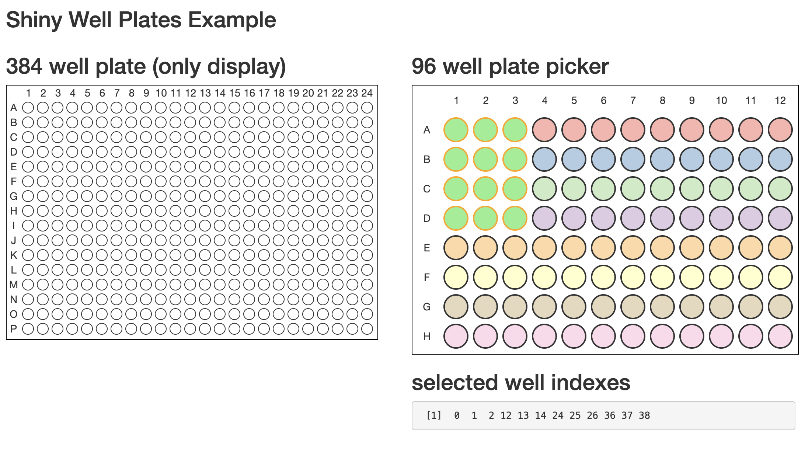

# shiny.wellplates

R bindings to [react-well-plates](https://www.npmjs.com/package/react-well-plates)
using [shiny.react](https://appsilon.github.io/shiny.react/).



## Installation

```
devtools::install_github("Appsilon/shiny.react")
```

## Usage

`WellPlate` function is a simple binding to the `WellPlate` component in react-well-plates.
For details of properties (arguments), please check react-well-plates's homepage.

```r
WellPlate(
  rows = 16,      # number of rows (required)
  columns = 24    # number of columns (required)
)
```

`WellPicker` function is a simple binding to the `MultiWellPicker` component in react-well-plates.
For details of properties (arguments), please check react-well-plates's homepage.

```r
WellPicker(
  "inputId",      # input id (required)
  rows = 8,       # number of rows (required)
  columns = 12    # number of columns (required)
)
```

`ColorfullWellPicker` function is a customized binding to the `MultiWellPicker` component in react-well-plates.
This function enables you to specify well colors by the `colors` argument.
The `colors` argument should be a vector whose length is equal to number of wells and
the order should be row-wise (i.e. first element is maped to A1 and second element is mapped to A2 and so on).

```r
ColorfullWellPicker(
  "inputId",      # input id (required)
  rows = 8,       # number of rows (required)
  columns = 12,   # number of columns (required)
  colors = colors # vector of colors (e.g. c("#FBB4A", "#B3CDE3", ...))
)
```
